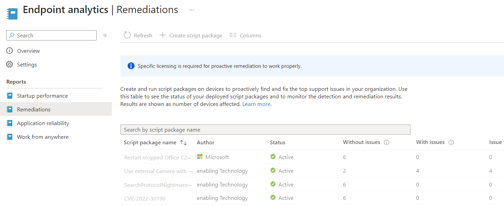
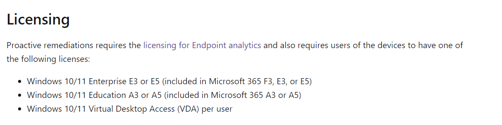

# Microsoft Endpoint Manager proactive remediation scripts

You will find some Microsoft Endpoint Manager (a/k/a Intune, a/k/a MEM) proactive remediation scripts here.

Some might not be up-to-date, but still will do the trick!

## Freeze due to license changes for proactive remediation

Due to the actual license changes from Microsoft for proactive remediation, we decided to freeze the development of the scripts.

Most of our customers don't have the proper licenses, it makes no sense!